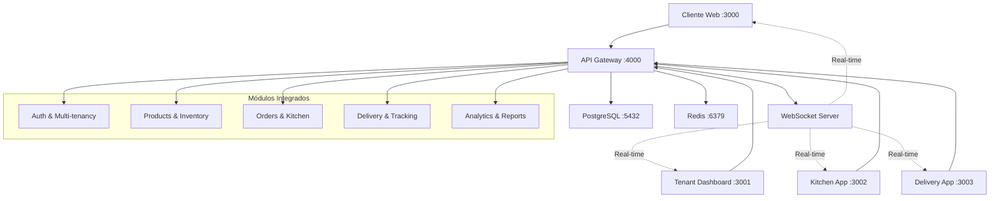
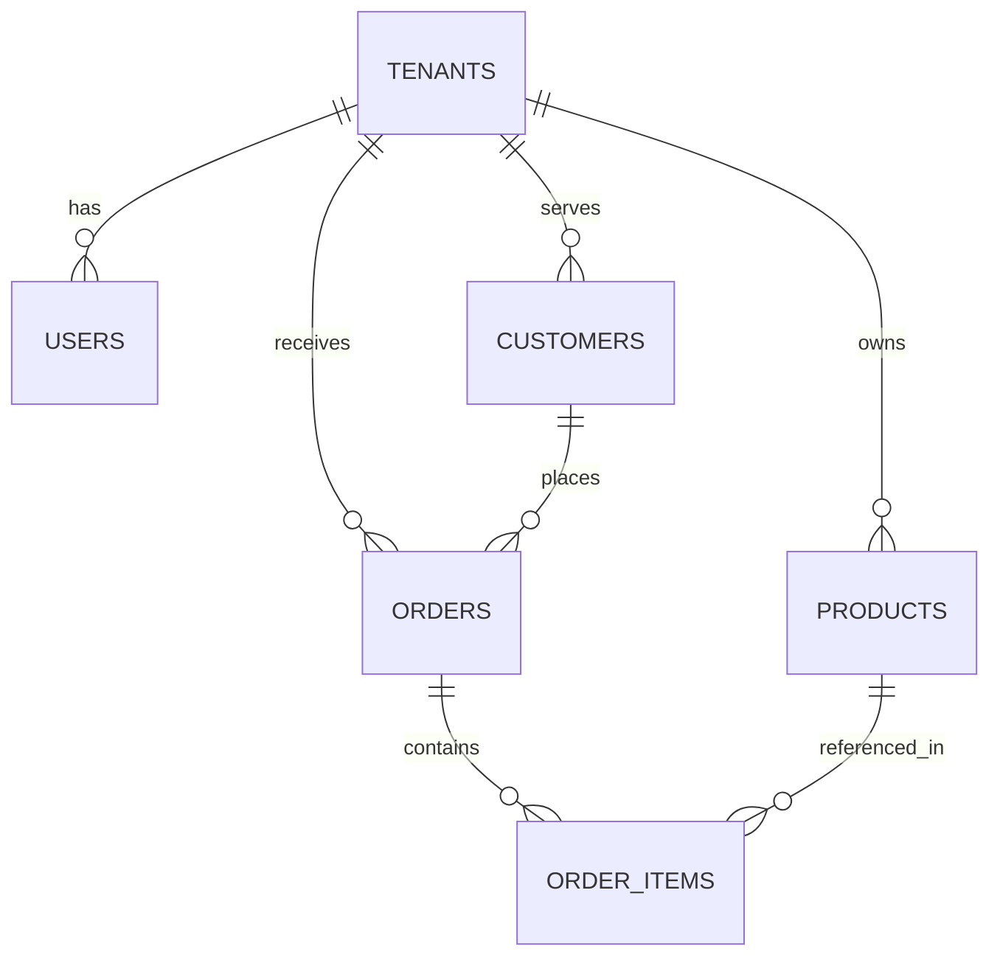

# 🍽️ FoodTrack - Sistema de Gestão de Restaurantes

[](https://www.typescriptlang.org/)
[](https://nodejs.org/)
[](https://reactjs.org/)
[](https://www.postgresql.org/)
[](https://www.docker.com/)

Sistema completo de gestão de restaurantes com **multi-tenancy**, incluindo aplicação cliente para pedidos, dashboard administrativo e backend robusto com autenticação JWT.

## 📋 Índice

- [🏗️ Arquitetura](#️-arquitetura)
- [🚀 Quick Start](#-quick-start)
- [📱 Aplicações](#-aplicações)
- [🔧 Desenvolvimento](#️-desenvolvimento)
- [🗄️ Banco de Dados](#️-banco-de-dados)
- [🔐 Autenticação](#-autenticação)
- [📊 API Documentation](#-api-documentation)
- [🐳 Docker](#-docker)
- [🧪 Testes](#-testes)
- [🚢 Deploy](#-deploy)

## 🏗️ Arquitetura

### Estrutura do Monorepo

```
foodtrack/
├── 📁 frontend/
│   ├── 📱 client/              # App Cliente (React + Vite)
│   ├── 🏢 tenant/              # Dashboard Tenant (React + Vite)
│   ├── 👨‍🍳 kitchen/             # App Cozinha (React + Vite + Socket.IO)
│   └── 🚚 delivery/            # App Entregadores (React + Vite)
├── 📁 backend/
│   ├── 🔌 api-gateway/         # API Gateway integrada (Express + TypeScript)
│   ├── 🔧 shared/              # Modelos e utilitários compartilhados
│   └── 🗄️ migrations/          # Scripts de banco de dados
├── 📁 admin/
│   └── ⚙️ platform-admin/      # Admin da plataforma (futuro)
├── 📁 infrastructure/
│   ├── ☸️ k8s/                 # Kubernetes manifests
│   ├── 🔄 ci-cd/               # Pipelines CI/CD
│   └── 💾 storage/             # Configurações de storage
├── 📁 packages/
│   └── 📦 types/               # Tipos TypeScript compartilhados
├── 📁 docs/                    # Documentação completa
└── 📁 scripts/                 # Scripts de automação
```

### Fluxo de Dados



## 🚀 Quick Start

### Pré-requisitos

- **Node.js** 18+ ([Download](https://nodejs.org/))
- **pnpm** 8+ ([Instalação](https://pnpm.io/installation))
- **Docker** & **Docker Compose** ([Download](https://www.docker.com/))
- **Git** ([Download](https://git-scm.com/))

### Instalação Rápida

```bash
# 1. Clone o repositório
git clone <repo-url>
cd foodtrack

# 2. Execute o script de setup (recomendado)
chmod +x scripts/setup.sh
./scripts/setup.sh

# 3. Inicie o desenvolvimento
pnpm dev
```

### Instalação Manual

```bash
# 1. Clone o repositório
git clone <repo-url>
cd foodtrack

# 2. Instale as dependências
pnpm install

# 3. Configure o ambiente
cp backend/api-gateway/.env.example backend/api-gateway/.env

# 4. Inicie os serviços de desenvolvimento
docker-compose -f docker-compose.dev.yml up -d

# 5. Execute as migrations
pnpm migrate

# 6. Build dos pacotes compartilhados
pnpm build:types && pnpm build:shared

# 7. Inicie o desenvolvimento
pnpm dev
```

### Verificação da Instalação

```bash
# Verificar se todos os serviços estão rodando
curl http://localhost:4000/health

# Testar login
curl -X POST http://localhost:4000/api/auth/login \
  -H "Content-Type: application/json" \
  -d '{"email":"test@test.com","password":"123456"}'
```

## 📱 Aplicações

### 🛒 Cliente Web
- **URL**: http://localhost:3000
- **Descrição**: Interface para clientes fazerem pedidos
- **Tecnologias**: React, TypeScript, Vite, TailwindCSS
- **Funcionalidades**:
  - 📋 Catálogo de produtos com filtros
  - 🛒 Carrinho de compras inteligente
  - 💳 Checkout com múltiplos métodos de pagamento
  - 📍 Rastreamento de pedidos em tempo real
  - 📱 Design responsivo (mobile-first)

### 🏢 Dashboard Tenant
- **URL**: http://localhost:3001
- **Descrição**: Dashboard administrativo para restaurantes
- **Tecnologias**: React, TypeScript, Vite, Radix UI
- **Funcionalidades**:
  - 📊 Dashboard com métricas em tempo real
  - 🍕 Gestão completa de produtos e categorias
  - 📋 Controle de pedidos e status
  - 💰 Relatórios financeiros e analytics
  - ⚙️ Configurações do estabelecimento
  - 👥 Gestão de usuários e permissões

### 👨‍🍳 Kitchen App
- **URL**: http://localhost:3002
- **Descrição**: Interface para cozinha e preparo de pedidos
- **Tecnologias**: React, TypeScript, Vite, Socket.IO
- **Funcionalidades**:
  - 📋 Visualização de pedidos em tempo real
  - ⏱️ Controle de tempo de preparo
  - 🔄 Atualização de status de pedidos
  - 📊 Dashboard de performance da cozinha
  - 🔔 Notificações sonoras para novos pedidos

### 🚚 Delivery App
- **URL**: http://localhost:3003
- **Descrição**: Interface para entregadores
- **Tecnologias**: React, TypeScript, Vite, React Router
- **Funcionalidades**:
  - 📦 Lista de entregas disponíveis
  - 🗺️ Informações de endereço e rota
  - 📱 Atualização de status de entrega
  - 💰 Controle de pagamentos
  - 📊 Histórico de entregas

### 🔌 API Gateway
- **URL**: http://localhost:4000
- **Descrição**: Backend integrado do sistema
- **Tecnologias**: Express, TypeScript, PostgreSQL, Redis, Socket.IO
- **Funcionalidades**:
  - 🔐 Autenticação JWT com refresh tokens
  - 🏢 Multi-tenancy com isolamento de dados
  - 📝 CRUD completo de recursos
  - 🛡️ Middleware de segurança (CORS, Helmet, Rate Limiting)
  - ✅ Validação de dados com Zod
  - 🔄 WebSocket para comunicação em tempo real
  - 📊 Logging e monitoramento integrado

## 🔧 Desenvolvimento

### Scripts Disponíveis

```bash
# Desenvolvimento
pnpm dev                    # Inicia todos os serviços
pnpm dev:client            # Apenas cliente web
pnpm dev:tenant            # Apenas dashboard tenant
pnpm dev:api               # Apenas API Gateway

# Build
pnpm build                 # Build de todos os projetos
pnpm build:types           # Build apenas tipos
pnpm build:shared          # Build backend compartilhado

# Database
pnpm migrate               # Executar migrations
pnpm db:reset              # Reset do banco (cuidado!)

# Qualidade de Código
pnpm lint                  # Linting
pnpm type-check            # Verificação de tipos
pnpm test                  # Executar testes

# Utilitários
pnpm clean                 # Limpar node_modules
pnpm setup                 # Setup completo do projeto
```

### Estrutura de Tipos Unificados

O projeto utiliza tipos TypeScript compartilhados através do pacote `@foodtrack/types`:

```typescript
// Exemplo de uso
import { 
  Product, 
  Order, 
  CartItem, 
  AdminScreen, 
  WebScreen,
  User,
  Customer 
} from '@foodtrack/types';

// Todos os tipos são consistentes entre frontend e backend
const product: Product = {
  id: '123',
  name: 'Pizza Margherita',
  price: 42.00,
  // ... outros campos
};
```

### Padrões de Desenvolvimento

#### 1. **Convenções de Nomenclatura**
```typescript
// Interfaces: PascalCase
interface UserProfile { }

// Tipos: PascalCase
type OrderStatus = 'pending' | 'confirmed';

// Variáveis: camelCase
const userProfile = { };

// Constantes: UPPER_SNAKE_CASE
const API_BASE_URL = 'http://localhost:4000';
```

#### 2. **Estrutura de Componentes**
```typescript
// components/ProductCard/index.tsx
export { ProductCard } from './ProductCard';

// components/ProductCard/ProductCard.tsx
interface ProductCardProps {
  product: Product;
  onAddToCart: (product: Product) => void;
}

export function ProductCard({ product, onAddToCart }: ProductCardProps) {
  // Implementação
}
```

#### 3. **Gerenciamento de Estado**
```typescript
// Usar Context API para estado global
// Usar useState/useReducer para estado local
// Usar React Query para estado do servidor (futuro)
```

## 🗄️ Banco de Dados

### Estrutura Principal

```sql
-- Principais tabelas
tenants         -- Estabelecimentos/restaurantes
users           -- Usuários do sistema  
products        -- Catálogo de produtos
orders          -- Pedidos dos clientes
customers       -- Base de clientes
notifications   -- Histórico de notificações
categories      -- Categorias de produtos
```

### Relacionamentos



### Acesso ao Banco

- **Adminer**: http://localhost:8082
- **Credenciais**:
  - Sistema: PostgreSQL
  - Servidor: postgres  
  - Usuário: postgres
  - Senha: postgres
  - Base de dados: foodtrack

### Migrations

```bash
# Executar migrations
pnpm migrate

# Criar nova migration
# Adicione um arquivo .sql em backend/migrations/
# Exemplo: 003_add_reviews_table.sql
```

## 🔐 Autenticação

### Sistema JWT

O sistema utiliza **JSON Web Tokens (JWT)** para autenticação:

```typescript
// Payload do JWT
interface JWTPayload {
  userId: string;
  tenantId: string;
  email: string;
  role: string;
}
```

### Fluxo de Autenticação

1. **Login**: `POST /api/auth/login`
2. **Recebe**: Token JWT + Refresh Token
3. **Usa**: Header `Authorization: Bearer <token>`
4. **Renova**: Quando token expira

### Credenciais de Teste

```bash
# Usuário de desenvolvimento
Email: test@test.com
Senha: 123456
Role: admin
```

### Multi-Tenancy

Todos os dados são isolados por `tenant_id`:

```typescript
// Middleware automático injeta tenantId
app.use('/api', authMiddleware);
app.use('/api', tenantMiddleware);

// Todas as queries filtram por tenant
const products = await productRepository.findAll(req.tenantId);
```

## 📊 API Documentation

### Endpoints Principais

#### Autenticação
```http
POST /api/auth/login
POST /api/auth/register
POST /api/auth/refresh
```

#### Produtos
```http
GET    /api/products              # Listar produtos
GET    /api/products/:id          # Obter produto
POST   /api/products              # Criar produto
PUT    /api/products/:id          # Atualizar produto
DELETE /api/products/:id          # Deletar produto
```

#### Pedidos
```http
GET    /api/orders                # Listar pedidos
GET    /api/orders/:id            # Obter pedido
POST   /api/orders                # Criar pedido
PUT    /api/orders/:id/status     # Atualizar status
```

#### Dashboard
```http
GET    /api/dashboard/metrics     # Métricas gerais
GET    /api/dashboard/sales-chart # Dados de vendas
```

### Exemplos de Uso

```bash
# Login
curl -X POST http://localhost:4000/api/auth/login \
  -H "Content-Type: application/json" \
  -d '{"email":"test@test.com","password":"123456"}'

# Listar produtos (com autenticação)
curl http://localhost:4000/api/products \
  -H "Authorization: Bearer <seu-token>"

# Criar produto
curl -X POST http://localhost:4000/api/products \
  -H "Authorization: Bearer <seu-token>" \
  -H "Content-Type: application/json" \
  -d '{
    "name": "Pizza Calabresa",
    "description": "Pizza com calabresa e cebola",
    "price": 38.90,
    "category": "lanches",
    "image": "https://example.com/pizza.jpg"
  }'
```

## 🐳 Docker

### Desenvolvimento Local

```bash
# Iniciar serviços
docker-compose -f docker-compose.dev.yml up -d

# Parar serviços
docker-compose -f docker-compose.dev.yml down

# Ver logs
docker-compose -f docker-compose.dev.yml logs -f

# Reset completo
docker-compose -f docker-compose.dev.yml down -v
docker-compose -f docker-compose.dev.yml up -d
```

### Serviços Inclusos

- **PostgreSQL 15**: Banco principal
- **Redis 7**: Cache e sessões
- **Adminer**: Interface web do banco

## 🧪 Testes

### Estrutura de Testes

```bash
# Executar todos os testes
pnpm test

# Testes por projeto
pnpm test:types      # Testes dos tipos
pnpm test:shared     # Testes do backend compartilhado
pnpm test:api        # Testes da API
pnpm test:client     # Testes do cliente
pnpm test:tenant     # Testes do tenant

# Testes com coverage
pnpm test:coverage
```

### Tipos de Teste

1. **Unit Tests**: Funções e componentes isolados
2. **Integration Tests**: APIs e banco de dados
3. **E2E Tests**: Fluxos completos do usuário
4. **Type Tests**: Validação de tipos TypeScript

## 🚢 Deploy

### Ambientes

- **Development**: Local com Docker
- **Staging**: Kubernetes cluster
- **Production**: Kubernetes cluster

### CI/CD Pipeline

```yaml
# .github/workflows/deploy.yml
name: Deploy
on:
  push:
    branches: [main]
jobs:
  test:
    runs-on: ubuntu-latest
    steps:
      - uses: actions/checkout@v3
      - run: pnpm install
      - run: pnpm test
      - run: pnpm build
  
  deploy:
    needs: test
    runs-on: ubuntu-latest
    steps:
      - run: kubectl apply -f infrastructure/k8s/
```

### Variáveis de Ambiente

```bash
# Produção
NODE_ENV=production
JWT_SECRET=<secret-super-seguro>
DB_HOST=<host-do-banco>
DB_PASSWORD=<senha-segura>
REDIS_URL=<url-do-redis>
```

## 🤝 Contribuição

### Como Contribuir

1. **Fork** o projeto
2. **Crie** uma branch para sua feature (`git checkout -b feature/nova-funcionalidade`)
3. **Commit** suas mudanças (`git commit -m 'Adiciona nova funcionalidade'`)
4. **Push** para a branch (`git push origin feature/nova-funcionalidade`)
5. **Abra** um Pull Request

### Padrões de Commit

```bash
feat: adiciona nova funcionalidade
fix: corrige bug
docs: atualiza documentação
style: formatação de código
refactor: refatoração sem mudança de funcionalidade
test: adiciona ou corrige testes
chore: tarefas de manutenção
```

### Code Review

- ✅ Todos os testes passando
- ✅ Cobertura de testes mantida
- ✅ Documentação atualizada
- ✅ Tipos TypeScript corretos
- ✅ Padrões de código seguidos

## 📞 Suporte

- **Issues**: [GitHub Issues](https://github.com/seu-usuario/foodtrack/issues)
- **Documentação**: [Wiki do Projeto](https://github.com/seu-usuario/foodtrack/wiki)
- **Email**: suporte@foodtrack.com
- **Discord**: [Servidor da Comunidade](https://discord.gg/foodtrack)

## 📄 Licença

Este projeto está sob a licença **MIT**. Veja o arquivo [LICENSE](LICENSE) para detalhes.

---

<div align="center">

**FoodTrack** - Transformando a gestão de restaurantes 🍽️

[](https://github.com/seu-usuario/foodtrack)
[](https://www.typescriptlang.org/)

</div>