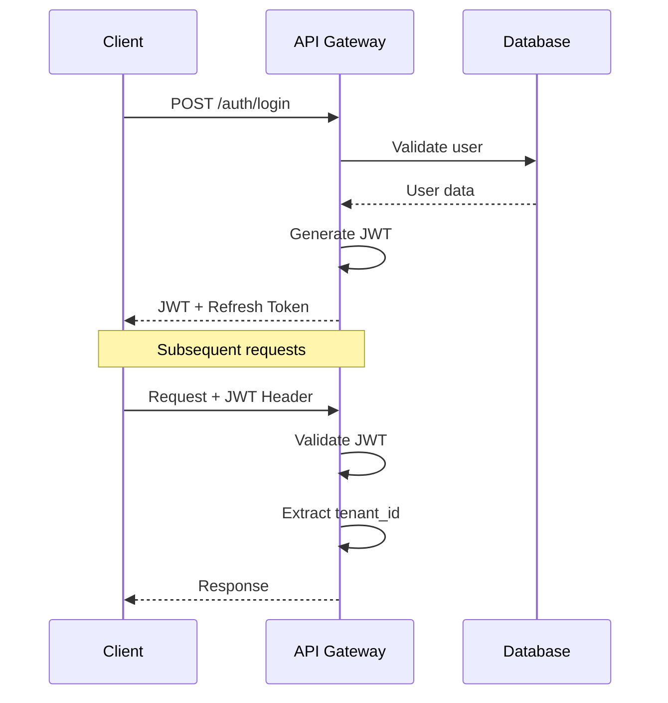
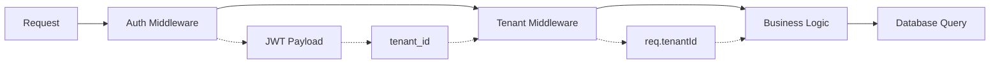
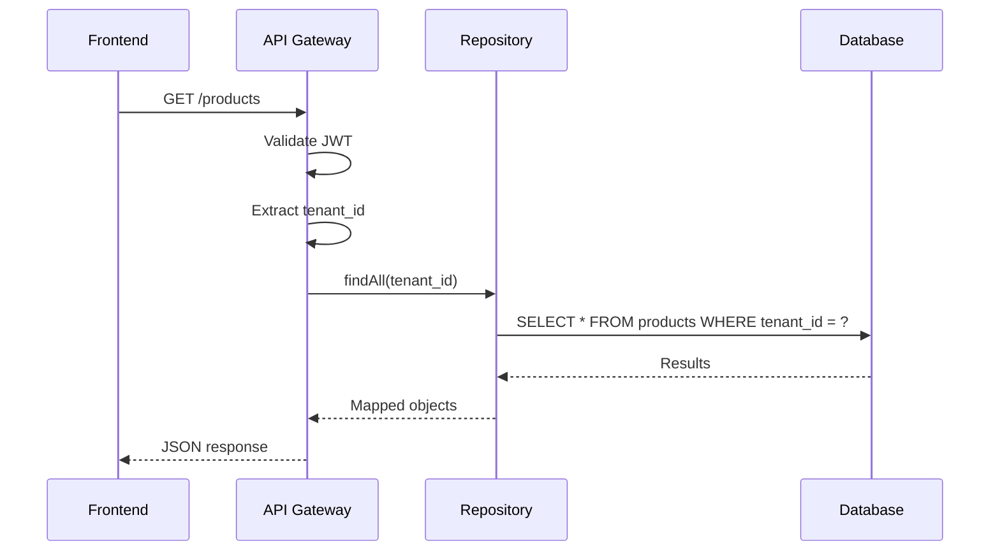

# 🏗️ Arquitetura do Sistema FoodTrack

**Versão:** 1.1  
**Última Atualização:** 23 de Dezembro de 2024

## Visão Geral

O FoodTrack é construído como um **monorepo multi-tenant** com arquitetura **modular integrada**, utilizando **TypeScript** em todo o stack para garantir type safety e consistência entre todas as aplicações.

## Princípios Arquiteturais

### 1. **Separation of Concerns**
- Frontend e Backend completamente desacoplados
- Cada microserviço tem responsabilidade única
- Tipos compartilhados garantem consistência

### 2. **Multi-Tenancy**
- Isolamento completo de dados por `tenant_id`
- Middleware automático de tenant
- Escalabilidade horizontal por tenant

### 3. **Type Safety**
- TypeScript em 100% do código
- Tipos compartilhados entre frontend e backend
- Validação runtime com Zod

### 4. **Security First**
- JWT com refresh tokens
- Rate limiting por IP
- Validação de entrada em todas as APIs
- CORS configurado adequadamente

## Estrutura de Camadas

```
┌─────────────────────────────────────────────────────────────┐
│                    Frontend Layer                           │
├─────────────────┬─────────────────┬─────────────────────────┤
│   Client Web    │ Tenant Dashboard│  Kitchen & Delivery     │
│   (Port 3000)   │   (Port 3001)   │  (Ports 3002, 3003)     │
└─────────────────┴─────────────────┴─────────────────────────┘
                              │
┌─────────────────────────────────────────────────────────────┐
│                   API Gateway (Port 4000)                   │
├─────────────────────────────────────────────────────────────┤
│  Auth │ Products │ Orders │ Dashboard │ Kitchen │ Delivery  │
└─────────────────────────────────────────────────────────────┘
                              │
┌─────────────────────────────────────────────────────────────┐
│                     Data Layer                              │
├─────────────────────────────────────────────────────────────┤
│  PostgreSQL (5432) │    Redis (6379)    │  File Storage    │
└─────────────────────────────────────────────────────────────┘
```

## Componentes Principais

### Frontend

#### Client Web (`frontend/client`)
- **Tecnologia**: React 18 + Vite + TypeScript
- **UI**: TailwindCSS + Radix UI
- **Estado**: Context API + React Query (futuro)
- **Responsabilidade**: Interface para clientes

#### Tenant Dashboard (`frontend/tenant`)
- **Tecnologia**: React 18 + Vite + TypeScript
- **UI**: TailwindCSS + Radix UI + Recharts
- **Estado**: Context API + React Hook Form
- **Responsabilidade**: Gestão do restaurante

#### Kitchen App (`frontend/kitchen`)
- **Tecnologia**: React 18 + Vite + TypeScript + Socket.IO
- **UI**: TailwindCSS + Radix UI
- **Estado**: Context API + WebSocket para tempo real
- **Responsabilidade**: Interface para cozinha e preparo

#### Delivery App (`frontend/delivery`)
- **Tecnologia**: React 18 + Vite + TypeScript
- **UI**: TailwindCSS + Radix UI
- **Estado**: Context API + React Router
- **Responsabilidade**: Interface para entregadores

### Backend

#### API Gateway (`backend/api-gateway`)
- **Tecnologia**: Express + TypeScript
- **Banco**: PostgreSQL com pg
- **Cache**: Redis
- **Responsabilidade**: API principal, autenticação, CRUD

#### Shared (`backend/shared`)
- **Tecnologia**: TypeScript
- **Responsabilidade**: Modelos, utilitários, validações

#### Módulos Integrados (API Gateway)
- **Auth Module**: Autenticação JWT e autorização
- **Products Module**: Gestão de catálogo e estoque
- **Orders Module**: Processamento e rastreamento de pedidos
- **Kitchen Module**: Gestão de preparo e status
- **Delivery Module**: Coordenação de entregas
- **Dashboard Module**: Analytics e relatórios em tempo real
- **WebSocket Module**: Comunicação em tempo real entre apps

### Packages

#### Types (`packages/types`)
- **Tecnologia**: TypeScript
- **Responsabilidade**: Tipos compartilhados

## Fluxo de Dados

### 1. Autenticação


### 2. Multi-Tenancy


### 3. CRUD Operations


## Padrões de Design

### 1. Repository Pattern
```typescript
// Abstração para acesso a dados
abstract class BaseRepository<T> {
  abstract findById(id: string, tenantId?: string): Promise<T | null>;
  abstract findAll(tenantId?: string, filters?: any): Promise<T[]>;
  abstract create(data: Omit<T, 'id' | 'createdAt' | 'updatedAt'>): Promise<T>;
  abstract update(id: string, data: Partial<T>, tenantId?: string): Promise<T | null>;
  abstract delete(id: string, tenantId?: string): Promise<boolean>;
}
```

### 2. Middleware Pattern
```typescript
// Composição de middlewares
app.use(helmet());                    // Security
app.use(cors());                      // CORS
app.use(rateLimit());                 // Rate limiting
app.use(authMiddleware);              // Authentication
app.use(tenantMiddleware);            // Multi-tenancy
app.use('/api/products', productRoutes);
```

### 3. Factory Pattern
```typescript
// Criação de repositórios
class RepositoryFactory {
  static createUserRepository(): UserRepository {
    return new UserRepository();
  }
  
  static createProductRepository(): ProductRepository {
    return new ProductRepository();
  }
}
```

## Segurança

### 1. Autenticação e Autorização
- **JWT** com expiração configurável
- **Refresh tokens** para renovação
- **Role-based access control** (RBAC)
- **Middleware de autenticação** em todas as rotas protegidas

### 2. Validação de Dados
```typescript
// Validação com Zod
const CreateProductSchema = z.object({
  name: z.string().min(1),
  price: z.number().positive(),
  // ...
});

// Uso no endpoint
const data = CreateProductSchema.parse(req.body);
```

### 3. Rate Limiting
```typescript
const limiter = rateLimit({
  windowMs: 15 * 60 * 1000, // 15 minutos
  max: 100, // máximo 100 requests por IP
});
```

### 4. Sanitização
- **Helmet.js** para headers de segurança
- **CORS** configurado adequadamente
- **SQL injection** prevenido com queries parametrizadas

## Performance

### 1. Caching Strategy
- **Redis** para cache de sessões
- **Query caching** para dados frequentes
- **CDN** para assets estáticos (futuro)

### 2. Database Optimization
- **Indexes** em campos frequentemente consultados
- **Connection pooling** com pg
- **Query optimization** com EXPLAIN

### 3. Frontend Optimization
- **Code splitting** com Vite
- **Lazy loading** de componentes
- **Bundle optimization**

## Escalabilidade

### 1. Horizontal Scaling
- **Stateless API** permite múltiplas instâncias
- **Load balancer** distribui requisições
- **Database sharding** por tenant (futuro)

### 2. Microserviços
- **Event-driven architecture** com message queues
- **Service mesh** para comunicação
- **Circuit breaker** pattern para resiliência

### 3. Monitoring
- **Health checks** em todos os serviços
- **Metrics** com Prometheus (futuro)
- **Logging** centralizado com ELK stack (futuro)

## Deployment

### 1. Containerização
```dockerfile
# Multi-stage build
FROM node:18-alpine AS builder
WORKDIR /app
COPY package*.json ./
RUN npm ci --only=production

FROM node:18-alpine AS runtime
WORKDIR /app
COPY --from=builder /app/node_modules ./node_modules
COPY . .
EXPOSE 4000
CMD ["npm", "start"]
```

### 2. Kubernetes
```yaml
apiVersion: apps/v1
kind: Deployment
metadata:
  name: api-gateway
spec:
  replicas: 3
  selector:
    matchLabels:
      app: api-gateway
  template:
    metadata:
      labels:
        app: api-gateway
    spec:
      containers:
      - name: api-gateway
        image: foodtrack/api-gateway:latest
        ports:
        - containerPort: 4000
```

### 3. CI/CD
- **GitHub Actions** para automação
- **Docker Registry** para imagens
- **Helm Charts** para deployment
- **Blue-green deployment** para zero downtime

## Monitoramento e Observabilidade

### 1. Logging
```typescript
// Structured logging
logger.info('User login', {
  userId: user.id,
  tenantId: user.tenantId,
  timestamp: new Date().toISOString()
});
```

### 2. Metrics
- **Response time** por endpoint
- **Error rate** por serviço
- **Database connection pool** status
- **Memory usage** e **CPU utilization**

### 3. Tracing
- **Request ID** para rastreamento
- **Distributed tracing** entre serviços
- **Error tracking** com Sentry (futuro)

## Evolução da Arquitetura

### Fase 1 (Atual)
- ✅ Monolito modular
- ✅ Multi-tenancy
- ✅ Tipos compartilhados
- ✅ Autenticação JWT

### Fase 2 (Próxima)
- 🔄 Microserviços
- 🔄 Event sourcing
- 🔄 CQRS pattern
- 🔄 Message queues

### Fase 3 (Futuro)
- 📋 Service mesh
- 📋 Event streaming
- 📋 Machine learning
- 📋 Real-time analytics

## Considerações Técnicas

### 1. Trade-offs
- **Monorepo vs Multi-repo**: Escolhido monorepo para facilitar desenvolvimento
- **REST vs GraphQL**: REST para simplicidade inicial
- **SQL vs NoSQL**: PostgreSQL para consistência ACID

### 2. Decisões Arquiteturais
- **TypeScript everywhere**: Type safety e produtividade
- **Multi-tenancy**: Escalabilidade e isolamento
- **JWT**: Stateless e escalável
- **Docker**: Portabilidade e consistência

### 3. Limitações Atuais
- **Single database**: Pode ser gargalo no futuro
- **Monolito**: Deployment acoplado
- **No caching**: Performance pode ser melhorada

### 4. Próximas Melhorias
- **Database sharding** por tenant
- **Redis caching** para queries frequentes
- **Message queues** para processamento assíncrono
- **Monitoring** e **alerting** completos