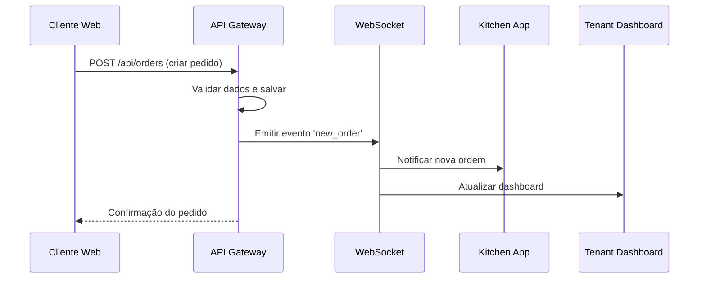
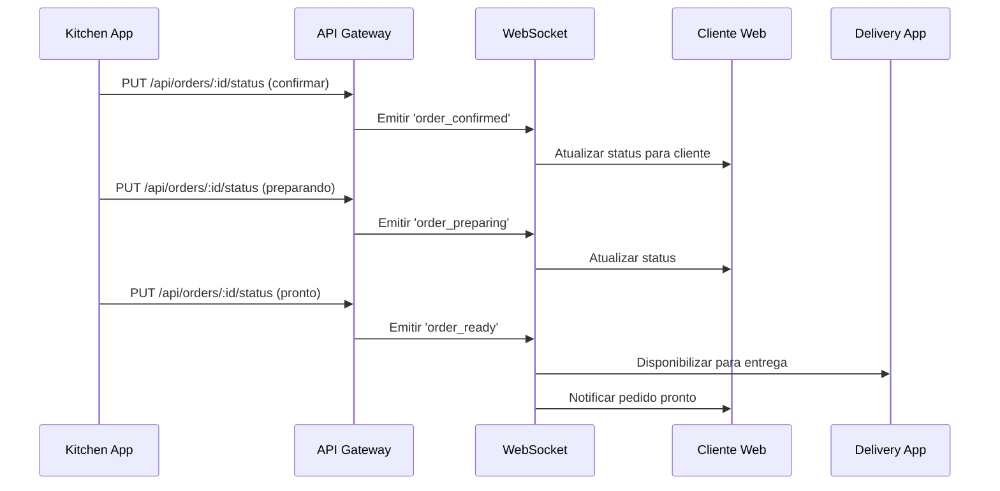
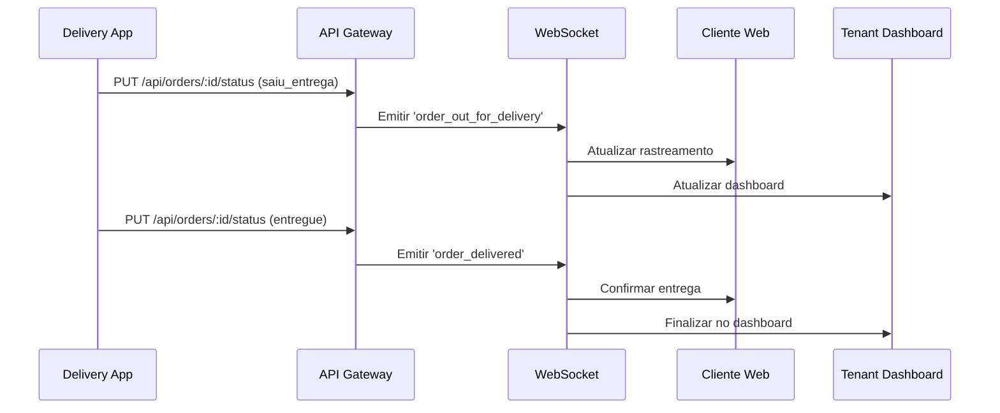

# 🔗 Guia de Integração - FoodTrack

## Visão Geral da Integração

O FoodTrack é projetado como um **ecossistema integrado** onde todas as aplicações trabalham de forma coordenada para proporcionar uma experiência fluida desde o pedido até a entrega.

## Fluxo Completo de Pedido

### 1. **Criação do Pedido (Cliente Web)**


### 2. **Processamento na Cozinha**


### 3. **Entrega (Delivery App)**


## Comunicação em Tempo Real

### WebSocket Events

O sistema utiliza **Socket.IO** para comunicação em tempo real entre todas as aplicações:

```typescript
// Eventos principais do sistema
interface SocketEvents {
  // Pedidos
  'new_order': Order;
  'order_confirmed': { orderId: string; status: OrderStatus };
  'order_preparing': { orderId: string; estimatedTime: number };
  'order_ready': { orderId: string };
  'order_out_for_delivery': { orderId: string; deliveryId: string };
  'order_delivered': { orderId: string };
  
  // Kitchen
  'kitchen_status_update': { orderId: string; status: string };
  'preparation_time_update': { orderId: string; timeRemaining: number };
  
  // Delivery
  'delivery_assigned': { orderId: string; deliveryPersonId: string };
  'delivery_location_update': { orderId: string; location: Coordinates };
  
  // Dashboard
  'metrics_update': DashboardMetrics;
  'new_notification': Notification;
}
```

### Implementação por Aplicação

#### Cliente Web
```typescript
// hooks/useOrderTracking.ts
import { useSocket } from '../contexts/SocketContext';

export function useOrderTracking(orderId: string) {
  const socket = useSocket();
  const [orderStatus, setOrderStatus] = useState<OrderStatus>('pending');
  
  useEffect(() => {
    socket.on('order_confirmed', (data) => {
      if (data.orderId === orderId) {
        setOrderStatus(data.status);
      }
    });
    
    socket.on('order_preparing', (data) => {
      if (data.orderId === orderId) {
        setOrderStatus('preparing');
        // Mostrar tempo estimado
      }
    });
    
    return () => {
      socket.off('order_confirmed');
      socket.off('order_preparing');
    };
  }, [orderId, socket]);
  
  return { orderStatus };
}
```

#### Kitchen App
```typescript
// hooks/useKitchenOrders.ts
import { useSocket } from '../contexts/SocketContext';

export function useKitchenOrders() {
  const socket = useSocket();
  const [orders, setOrders] = useState<Order[]>([]);
  
  useEffect(() => {
    socket.on('new_order', (order) => {
      setOrders(prev => [...prev, order]);
      // Tocar som de notificação
      playNotificationSound();
    });
    
    return () => socket.off('new_order');
  }, [socket]);
  
  const updateOrderStatus = (orderId: string, status: OrderStatus) => {
    socket.emit('kitchen_status_update', { orderId, status });
  };
  
  return { orders, updateOrderStatus };
}
```

#### Tenant Dashboard
```typescript
// hooks/useDashboardMetrics.ts
import { useSocket } from '../contexts/SocketContext';

export function useDashboardMetrics() {
  const socket = useSocket();
  const [metrics, setMetrics] = useState<DashboardMetrics>();
  
  useEffect(() => {
    socket.on('metrics_update', setMetrics);
    socket.on('new_order', () => {
      // Atualizar métricas em tempo real
      refreshMetrics();
    });
    
    return () => {
      socket.off('metrics_update');
      socket.off('new_order');
    };
  }, [socket]);
  
  return { metrics };
}
```

## Sincronização de Estado

### Context Providers Compartilhados

Cada aplicação utiliza contexts similares para manter consistência:

```typescript
// contexts/AuthContext.tsx (compartilhado entre apps)
interface AuthContextType {
  user: User | null;
  tenant: Tenant | null;
  login: (credentials: LoginCredentials) => Promise<void>;
  logout: () => void;
  isAuthenticated: boolean;
}

// contexts/OrderContext.tsx (adaptado por app)
interface OrderContextType {
  orders: Order[];
  currentOrder?: Order;
  updateOrderStatus: (orderId: string, status: OrderStatus) => void;
  refreshOrders: () => void;
}
```

### Gerenciamento de Cache

```typescript
// utils/cache.ts
class AppCache {
  private cache = new Map<string, any>();
  private ttl = new Map<string, number>();
  
  set(key: string, value: any, ttlMs = 300000) { // 5 min default
    this.cache.set(key, value);
    this.ttl.set(key, Date.now() + ttlMs);
  }
  
  get(key: string) {
    const expiry = this.ttl.get(key);
    if (expiry && Date.now() > expiry) {
      this.cache.delete(key);
      this.ttl.delete(key);
      return null;
    }
    return this.cache.get(key);
  }
}

export const appCache = new AppCache();
```

## Autenticação Unificada

### JWT Multi-App

Todas as aplicações compartilham o mesmo sistema de autenticação:

```typescript
// utils/auth.ts
interface JWTPayload {
  userId: string;
  tenantId: string;
  email: string;
  role: 'admin' | 'manager' | 'operator' | 'kitchen' | 'delivery';
  permissions: string[];
}

// Middleware de autorização por app
const appPermissions = {
  client: ['order:create', 'order:view'],
  tenant: ['order:manage', 'product:manage', 'dashboard:view'],
  kitchen: ['order:update_status', 'kitchen:view'],
  delivery: ['delivery:manage', 'order:update_status']
};
```

### Single Sign-On (SSO)

```typescript
// hooks/useSSO.ts
export function useSSO() {
  const navigate = useNavigate();
  
  const redirectToApp = (app: 'client' | 'tenant' | 'kitchen' | 'delivery') => {
    const token = localStorage.getItem('auth_token');
    const urls = {
      client: 'http://localhost:3000',
      tenant: 'http://localhost:3001',
      kitchen: 'http://localhost:3002',
      delivery: 'http://localhost:3003'
    };
    
    if (token) {
      window.location.href = `${urls[app]}?token=${token}`;
    }
  };
  
  return { redirectToApp };
}
```

## Notificações Cross-App

### Sistema de Notificações

```typescript
// types/notifications.ts
interface Notification {
  id: string;
  type: 'order' | 'kitchen' | 'delivery' | 'system';
  title: string;
  message: string;
  targetApp: 'all' | 'client' | 'tenant' | 'kitchen' | 'delivery';
  priority: 'low' | 'medium' | 'high' | 'urgent';
  data?: any;
  createdAt: Date;
  readAt?: Date;
}

// Exemplos de notificações
const notifications: Notification[] = [
  {
    id: '1',
    type: 'order',
    title: 'Novo Pedido',
    message: 'Pedido #1234 recebido',
    targetApp: 'kitchen',
    priority: 'high',
    data: { orderId: '1234' },
    createdAt: new Date()
  },
  {
    id: '2',
    type: 'delivery',
    title: 'Entrega Disponível',
    message: 'Pedido #1234 pronto para entrega',
    targetApp: 'delivery',
    priority: 'medium',
    data: { orderId: '1234', address: '...' },
    createdAt: new Date()
  }
];
```

### Push Notifications

```typescript
// utils/pushNotifications.ts
class PushNotificationService {
  private registration?: ServiceWorkerRegistration;
  
  async initialize() {
    if ('serviceWorker' in navigator && 'PushManager' in window) {
      this.registration = await navigator.serviceWorker.register('/sw.js');
    }
  }
  
  async subscribe() {
    if (!this.registration) return;
    
    const subscription = await this.registration.pushManager.subscribe({
      userVisibleOnly: true,
      applicationServerKey: process.env.VITE_VAPID_PUBLIC_KEY
    });
    
    // Enviar subscription para o backend
    await fetch('/api/notifications/subscribe', {
      method: 'POST',
      headers: { 'Content-Type': 'application/json' },
      body: JSON.stringify(subscription)
    });
  }
}
```

## Monitoramento e Analytics

### Métricas Cross-App

```typescript
// utils/analytics.ts
interface AppMetrics {
  app: string;
  userId: string;
  tenantId: string;
  event: string;
  data: any;
  timestamp: Date;
}

class AnalyticsService {
  track(event: string, data: any) {
    const metrics: AppMetrics = {
      app: process.env.VITE_APP_NAME || 'unknown',
      userId: getCurrentUser()?.id || 'anonymous',
      tenantId: getCurrentTenant()?.id || 'unknown',
      event,
      data,
      timestamp: new Date()
    };
    
    // Enviar para API
    fetch('/api/analytics/track', {
      method: 'POST',
      headers: { 'Content-Type': 'application/json' },
      body: JSON.stringify(metrics)
    });
  }
}

export const analytics = new AnalyticsService();

// Uso nas aplicações
analytics.track('order_created', { orderId: '1234', total: 45.90 });
analytics.track('kitchen_order_started', { orderId: '1234' });
analytics.track('delivery_completed', { orderId: '1234', duration: 1800 });
```

## Tratamento de Erros Unificado

### Error Boundary Global

```typescript
// components/ErrorBoundary.tsx
interface ErrorInfo {
  app: string;
  error: Error;
  errorInfo: React.ErrorInfo;
  userId?: string;
  tenantId?: string;
}

export class GlobalErrorBoundary extends React.Component {
  componentDidCatch(error: Error, errorInfo: React.ErrorInfo) {
    const errorData: ErrorInfo = {
      app: process.env.VITE_APP_NAME || 'unknown',
      error,
      errorInfo,
      userId: getCurrentUser()?.id,
      tenantId: getCurrentTenant()?.id
    };
    
    // Enviar erro para monitoramento
    fetch('/api/errors/report', {
      method: 'POST',
      headers: { 'Content-Type': 'application/json' },
      body: JSON.stringify(errorData)
    });
  }
}
```

## Deployment Coordenado

### Docker Compose Integrado

```yaml
# docker-compose.integration.yml
version: '3.8'
services:
  postgres:
    image: postgres:15-alpine
    environment:
      POSTGRES_DB: foodtrack
      POSTGRES_USER: postgres
      POSTGRES_PASSWORD: postgres
    ports:
      - "5432:5432"
    volumes:
      - postgres_data:/var/lib/postgresql/data

  redis:
    image: redis:7-alpine
    ports:
      - "6379:6379"

  api-gateway:
    build: ./backend/api-gateway
    ports:
      - "4000:4000"
    depends_on:
      - postgres
      - redis
    environment:
      - NODE_ENV=production
      - DB_HOST=postgres
      - REDIS_HOST=redis

  client-web:
    build: ./frontend/client
    ports:
      - "3000:80"
    environment:
      - VITE_API_URL=http://api-gateway:4000

  tenant-dashboard:
    build: ./frontend/tenant
    ports:
      - "3001:80"
    environment:
      - VITE_API_URL=http://api-gateway:4000

  kitchen-app:
    build: ./frontend/kitchen
    ports:
      - "3002:80"
    environment:
      - VITE_API_URL=http://api-gateway:4000
      - VITE_WS_URL=ws://api-gateway:4000

  delivery-app:
    build: ./frontend/delivery
    ports:
      - "3003:80"
    environment:
      - VITE_API_URL=http://api-gateway:4000

volumes:
  postgres_data:
```

### Health Checks Integrados

```typescript
// utils/healthCheck.ts
interface HealthStatus {
  app: string;
  status: 'healthy' | 'unhealthy' | 'degraded';
  checks: {
    api: boolean;
    database: boolean;
    websocket: boolean;
    cache: boolean;
  };
  timestamp: Date;
}

export async function performHealthCheck(): Promise<HealthStatus> {
  const checks = {
    api: await checkApiHealth(),
    database: await checkDatabaseHealth(),
    websocket: await checkWebSocketHealth(),
    cache: await checkCacheHealth()
  };
  
  const allHealthy = Object.values(checks).every(Boolean);
  const someHealthy = Object.values(checks).some(Boolean);
  
  return {
    app: process.env.VITE_APP_NAME || 'unknown',
    status: allHealthy ? 'healthy' : someHealthy ? 'degraded' : 'unhealthy',
    checks,
    timestamp: new Date()
  };
}
```

## Próximos Passos

### Roadmap de Integração

1. **Fase 1 - Comunicação Básica** ✅
   - WebSocket setup
   - Eventos básicos de pedidos
   - Autenticação compartilhada

2. **Fase 2 - Sincronização Avançada** 🔄
   - Cache distribuído
   - Offline support
   - Conflict resolution

3. **Fase 3 - Analytics Integrado** 📋
   - Métricas cross-app
   - Dashboards unificados
   - Alertas inteligentes

4. **Fase 4 - Microserviços** 📋
   - Separação de serviços
   - Message queues
   - Service mesh

### Considerações de Performance

- **Lazy Loading**: Carregar apenas componentes necessários
- **Code Splitting**: Dividir bundles por funcionalidade
- **Caching Strategy**: Cache inteligente entre apps
- **WebSocket Optimization**: Throttling e batching de eventos
- **Database Optimization**: Queries otimizadas e indexes

### Segurança Cross-App

- **CORS Configuration**: Configuração adequada entre apps
- **CSP Headers**: Content Security Policy
- **Rate Limiting**: Por app e por usuário
- **Input Validation**: Validação consistente
- **Audit Logging**: Log de ações críticas