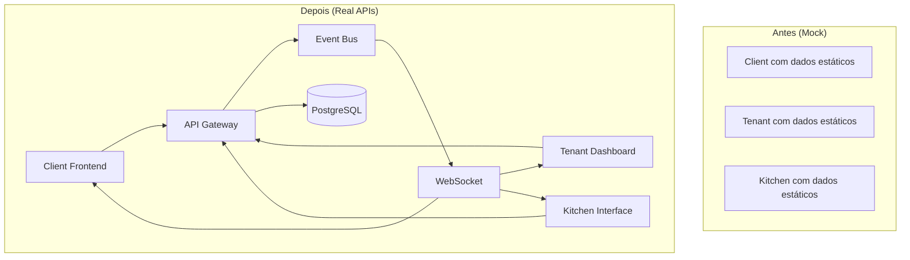

# 🔄 Mock to Real API Migration - Resumo Executivo

**Versão:** 1.1  
**Última Atualização:** 23 de Dezembro de 2024

## Visão Geral

A **Mock to Real API Migration** é a especificação que define a transição sistemática dos dados mockados (estáticos) para APIs reais conectadas ao banco de dados PostgreSQL, implementando a arquitetura event-driven completa do FoodTrack.

## 🎯 Objetivo

Substituir completamente os dados mockados por APIs funcionais que:
- Conectam ao banco de dados real
- Implementam o padrão Production Contract (ADR-001)
- Fornecem atualizações em tempo real via WebSocket
- Seguem a arquitetura event-driven definida

## 📊 Estado Atual vs. Estado Desejado

### **Estado Atual (Mockado)**
```typescript
// Dados estáticos no frontend
const mockProducts = [
  { id: '1', name: 'X-Burger', price: 25.90 },
  { id: '2', name: 'Pizza Margherita', price: 35.90 }
];

const mockOrders = [
  { id: '1', status: 'confirmed', total: 45.80 },
  { id: '2', status: 'preparing', total: 32.50 }
];
```

### **Estado Desejado (APIs Reais)**
```typescript
// APIs conectadas ao banco de dados
GET /api/products → PostgreSQL products table
POST /api/orders → Event-driven order creation
WebSocket → Real-time updates para todos os frontends
```

## 🏗️ Arquitetura da Migração



## 📋 Plano de Implementação (8 Semanas)

### **Sprint 1: Backend Foundation (Semanas 1-2)**
- ✅ **Database Schema**: Tabelas para tenants, products, orders, production_contracts
- ✅ **Event Infrastructure**: Event Bus, Event Store, WebSocket service
- ✅ **Products API**: CRUD completo com multi-tenancy
- ✅ **Database Seeding**: Dados realistas para desenvolvimento

### **Sprint 2: Orders e Kitchen (Semanas 3-4)**
- ✅ **Orders API**: Máquina de estados completa
- ✅ **Production Contract**: Implementação do ADR-001
- ✅ **Kitchen API**: Workflow de produção
- ✅ **WebSocket Real-time**: Comunicação bidirecional

### **Sprint 3: Frontend Integration (Semanas 5-6)**
- ✅ **Client Frontend**: Substituição completa de mock data
- ✅ **Tenant Dashboard**: Integração com APIs reais
- ✅ **Kitchen Interface**: Workflow de produção real

### **Sprint 4: Analytics e Otimização (Semanas 7-8)**
- ✅ **Analytics API**: Métricas calculadas em tempo real
- ✅ **Performance**: Otimização de queries e caching
- ✅ **Error Handling**: Tratamento robusto de erros
- ✅ **Testing**: Testes de integração completos

## 🔧 Principais Componentes Técnicos

### **1. Database Schema**
```sql
-- Multi-tenancy
CREATE TABLE tenants (id, name, slug, settings);

-- Core business
CREATE TABLE products (id, tenant_id, name, price, category, available);
CREATE TABLE orders (id, tenant_id, customer_id, status, items, total_amount);

-- Production Contract (ADR-001)
CREATE TABLE production_contracts (id, tenant_id, order_id, contract_data);
CREATE TABLE kitchen_orders (id, tenant_id, contract_id, status, assigned_station);

-- Event Sourcing
CREATE TABLE domain_events (id, tenant_id, stream_id, event_type, event_data);
```

### **2. API Endpoints**
```typescript
// Products
GET    /api/products              // Lista produtos do tenant
POST   /api/products              // Cria novo produto
PUT    /api/products/:id          // Atualiza produto

// Orders  
GET    /api/orders                // Lista pedidos com filtros
POST   /api/orders                // Cria novo pedido
PUT    /api/orders/:id/status     // Atualiza status

// Kitchen
GET    /api/kitchen/orders        // Pedidos para produção
POST   /api/kitchen/orders/:id/start    // Inicia preparo
PUT    /api/kitchen/orders/:id/ready    // Marca como pronto

// Analytics
GET    /api/analytics/revenue     // Métricas de receita
GET    /api/analytics/performance // Performance da cozinha
```

### **3. Event-Driven Flow**
```typescript
// Fluxo de eventos
OrderCreated → ProductionContractCreated → KitchenOrderCreated → 
PreparationStarted → IngredientConsumed → OrderReady → OrderDispatched
```

### **4. WebSocket Channels**
```typescript
// Real-time updates
'order:status'      // Status do pedido para cliente
'order:new'         // Novos pedidos para tenant
'kitchen:updated'   // Atualizações da cozinha
'analytics:metrics' // Métricas em tempo real
```

## 📈 Benefícios da Migração

### **Funcionalidade**
- ✅ **Dados Reais**: Operação com dados persistentes e consistentes
- ✅ **Multi-tenancy**: Isolamento completo entre restaurantes
- ✅ **Real-time**: Atualizações instantâneas via WebSocket
- ✅ **Event-driven**: Arquitetura desacoplada e escalável

### **Desenvolvimento**
- ✅ **Testabilidade**: APIs podem ser testadas independentemente
- ✅ **Escalabilidade**: Arquitetura suporta crescimento
- ✅ **Manutenibilidade**: Código organizado em bounded contexts
- ✅ **Observabilidade**: Event sourcing fornece auditoria completa

### **Negócio**
- ✅ **Operação Real**: Sistema funciona com dados de produção
- ✅ **Analytics**: Métricas baseadas em dados reais
- ✅ **Confiabilidade**: Persistência e recuperação de dados
- ✅ **Performance**: Otimizações de banco e caching

## 🎯 Critérios de Sucesso

A migração será considerada bem-sucedida quando:

- ✅ **Zero Mock Data**: Nenhum dado mockado permanece no código
- ✅ **APIs Funcionais**: Todos os endpoints respondem corretamente
- ✅ **Real-time**: WebSocket funciona em todos os frontends
- ✅ **Event Flow**: Arquitetura event-driven opera completamente
- ✅ **Performance**: APIs respondem em <500ms para 95% das requisições
- ✅ **Multi-tenancy**: Isolamento de dados funciona perfeitamente
- ✅ **Production Contract**: ADR-001 implementado corretamente
- ✅ **User Experience**: Frontends funcionam sem regressões

## 🚀 Próximos Passos

1. **Revisar Especificação**: Validar requirements, design e tasks
2. **Setup Ambiente**: Preparar banco de dados e infraestrutura
3. **Iniciar Sprint 1**: Começar com database schema e event infrastructure
4. **Implementação Incremental**: Seguir tasks definidas sprint por sprint
5. **Testes Contínuos**: Validar cada componente durante desenvolvimento
6. **Deploy Gradual**: Migrar frontends um por vez para reduzir riscos

## 📚 Documentação Relacionada

- **[Requirements](../.kiro/specs/mock-to-real-api-migration/requirements.md)**: Especificação completa
- **[Design](../.kiro/specs/mock-to-real-api-migration/design.md)**: Arquitetura técnica detalhada  
- **[Tasks](../.kiro/specs/mock-to-real-api-migration/tasks.md)**: Plano de implementação
- **[ADR-001](./ADR-001-Production-Contract.md)**: Production Contract pattern
- **[COM.md](../COM.md)**: Arquitetura V1.0 congelada

---

**Esta migração é o primeiro passo crítico para transformar o FoodTrack de um protótipo com dados mockados em um sistema operacional completo e funcional.**