# 📋 Especificação Técnica - FoodTrack

## Visão Geral do Sistema

O FoodTrack é um **ecossistema integrado** de aplicações para gestão completa de restaurantes, desde o pedido do cliente até a entrega final. O sistema é projetado com **arquitetura modular** onde cada aplicação tem responsabilidades específicas mas trabalha de forma coordenada.

## Arquitetura de Aplicações

### 1. **Cliente Web** (`frontend/client`)
**Propósito**: Interface para clientes fazerem pedidos
**Porta**: 3000
**Tecnologias**: React 18, TypeScript, Vite, TailwindCSS, Radix UI

#### Funcionalidades Principais
- 🛒 **Catálogo de Produtos**: Navegação e busca de produtos
- 🛍️ **Carrinho de Compras**: Gestão de itens e cálculos
- 💳 **Checkout**: Processo de finalização de pedido
- 📍 **Rastreamento**: Acompanhamento em tempo real do pedido
- 👤 **Perfil do Cliente**: Gestão de dados pessoais e histórico

#### Integração com Sistema
```typescript
// Fluxo principal de pedido
1. Cliente navega no catálogo (GET /api/products)
2. Adiciona itens ao carrinho (localStorage + Context)
3. Finaliza pedido (POST /api/orders)
4. Recebe confirmação via WebSocket
5. Acompanha status em tempo real
```

### 2. **Tenant Dashboard** (`frontend/tenant`)
**Propósito**: Dashboard administrativo para restaurantes
**Porta**: 3001
**Tecnologias**: React 18, TypeScript, Vite, TailwindCSS, Radix UI, Recharts

#### Funcionalidades Principais
- 📊 **Dashboard Analytics**: Métricas de vendas e performance
- 🍕 **Gestão de Produtos**: CRUD completo de catálogo
- 📋 **Gestão de Pedidos**: Visualização e controle de pedidos
- 👥 **Gestão de Usuários**: Controle de acesso e permissões
- ⚙️ **Configurações**: Personalização do estabelecimento

#### Integração com Sistema
```typescript
// Fluxo de gestão
1. Login com credenciais de tenant (POST /api/auth/login)
2. Visualiza dashboard em tempo real (WebSocket + API)
3. Gerencia produtos (CRUD /api/products)
4. Monitora pedidos (WebSocket events)
5. Analisa métricas (GET /api/dashboard/*)
```

### 3. **Kitchen App** (`frontend/kitchen`)
**Propósito**: Interface para cozinha e preparo de pedidos
**Porta**: 3002
**Tecnologias**: React 18, TypeScript, Vite, Socket.IO, TailwindCSS

#### Funcionalidades Principais
- 📋 **Fila de Pedidos**: Visualização de pedidos pendentes
- ⏱️ **Timer de Preparo**: Controle de tempo de cada pedido
- 🔄 **Atualização de Status**: Mudança de status dos pedidos
- 🔔 **Notificações**: Alertas sonoros para novos pedidos
- 📊 **Métricas da Cozinha**: Performance e tempo médio

#### Integração com Sistema
```typescript
// Fluxo da cozinha
1. Recebe notificação de novo pedido (WebSocket)
2. Visualiza detalhes do pedido (GET /api/orders/:id)
3. Inicia preparo (PUT /api/orders/:id/status)
4. Atualiza progresso em tempo real (WebSocket)
5. Finaliza pedido (PUT /api/orders/:id/status)
```

### 4. **Delivery App** (`frontend/delivery`)
**Propósito**: Interface para entregadores
**Porta**: 3003
**Tecnologias**: React 18, TypeScript, Vite, React Router, TailwindCSS

#### Funcionalidades Principais
- 📦 **Lista de Entregas**: Pedidos disponíveis para entrega
- 🗺️ **Informações de Rota**: Endereços e instruções
- 📱 **Atualização de Status**: Controle do processo de entrega
- 💰 **Gestão de Pagamentos**: Controle de valores e troco
- 📊 **Histórico**: Entregas realizadas e métricas

#### Integração com Sistema
```typescript
// Fluxo de entrega
1. Visualiza pedidos prontos (GET /api/orders?status=ready)
2. Aceita entrega (PUT /api/orders/:id/delivery)
3. Atualiza status de saída (PUT /api/orders/:id/status)
4. Confirma entrega (PUT /api/orders/:id/status)
5. Registra feedback (POST /api/orders/:id/feedback)
```

### 5. **API Gateway** (`backend/api-gateway`)
**Propósito**: Backend integrado do sistema
**Porta**: 4000
**Tecnologias**: Express, TypeScript, PostgreSQL, Redis, Socket.IO

#### Módulos Principais
- 🔐 **Auth Module**: Autenticação e autorização
- 🍕 **Products Module**: Gestão de catálogo
- 📋 **Orders Module**: Processamento de pedidos
- 👨‍🍳 **Kitchen Module**: Integração com cozinha
- 🚚 **Delivery Module**: Gestão de entregas
- 📊 **Analytics Module**: Métricas e relatórios
- 🔄 **WebSocket Module**: Comunicação em tempo real

## Fluxo de Dados Integrado

### Ciclo Completo de Pedido

```mermaid
sequenceDiagram
    participant C as Cliente Web
    participant API as API Gateway
    participant WS as WebSocket
    participant T as Tenant Dashboard
    participant K as Kitchen App
    participant D as Delivery App
    
    Note over C,D: 1. Criação do Pedido
    C->>API: POST /api/orders
    API->>API: Validar e salvar
    API->>WS: Emit 'new_order'
    WS->>T: Notificar dashboard
    WS->>K: Notificar cozinha
    API-->>C: Confirmação
    
    Note over C,D: 2. Processamento na Cozinha
    K->>API: PUT /api/orders/:id/status (preparing)
    API->>WS: Emit 'order_preparing'
    WS->>C: Atualizar status
    WS->>T: Atualizar dashboard
    
    K->>API: PUT /api/orders/:id/status (ready)
    API->>WS: Emit 'order_ready'
    WS->>D: Disponibilizar entrega
    WS->>C: Pedido pronto
    
    Note over C,D: 3. Entrega
    D->>API: PUT /api/orders/:id/status (out_for_delivery)
    API->>WS: Emit 'order_out_for_delivery'
    WS->>C: Saiu para entrega
    
    D->>API: PUT /api/orders/:id/status (delivered)
    API->>WS: Emit 'order_delivered'
    WS->>C: Entregue
    WS->>T: Finalizar no dashboard
```



## Comunicação em Tempo Real

### WebSocket Events

```typescript
// Eventos do sistema
interface SystemEvents {
  // Pedidos
  'new_order': {
    order: Order;
    targetApps: ['kitchen', 'tenant'];
  };
  
  'order_status_changed': {
    orderId: string;
    oldStatus: OrderStatus;
    newStatus: OrderStatus;
    targetApps: ['client', 'tenant', 'kitchen', 'delivery'];
  };
  
  // Cozinha
  'kitchen_timer_update': {
    orderId: string;
    timeRemaining: number;
    targetApps: ['kitchen', 'tenant'];
  };
  
  'kitchen_capacity_update': {
    currentOrders: number;
    maxCapacity: number;
    targetApps: ['tenant'];
  };
  
  // Entrega
  'delivery_assigned': {
    orderId: string;
    deliveryPersonId: string;
    estimatedTime: number;
    targetApps: ['client', 'tenant', 'delivery'];
  };
  
  'delivery_location_update': {
    orderId: string;
    location: Coordinates;
    targetApps: ['client', 'tenant'];
  };
  
  // Sistema
  'system_notification': {
    type: 'info' | 'warning' | 'error';
    message: string;
    targetApps: string[];
  };
}
```

### Implementação WebSocket

```typescript
// backend/api-gateway/src/websocket/socketManager.ts
class SocketManager {
  private io: Server;
  private connectedClients = new Map<string, Socket>();
  
  constructor(server: any) {
    this.io = new Server(server, {
      cors: { origin: "*" }
    });
    
    this.setupEventHandlers();
  }
  
  private setupEventHandlers() {
    this.io.on('connection', (socket) => {
      socket.on('authenticate', async (token) => {
        const user = await this.authenticateSocket(token);
        if (user) {
          socket.join(`tenant:${user.tenantId}`);
          socket.join(`user:${user.id}`);
          this.connectedClients.set(socket.id, socket);
        }
      });
      
      socket.on('disconnect', () => {
        this.connectedClients.delete(socket.id);
      });
    });
  }
  
  emitToTenant(tenantId: string, event: string, data: any) {
    this.io.to(`tenant:${tenantId}`).emit(event, data);
  }
  
  emitToApps(apps: string[], event: string, data: any) {
    apps.forEach(app => {
      this.io.to(`app:${app}`).emit(event, data);
    });
  }
}
```

## Autenticação e Autorização

### Sistema JWT Multi-App

```typescript
// Payload JWT unificado
interface JWTPayload {
  userId: string;
  tenantId: string;
  email: string;
  role: 'admin' | 'manager' | 'operator' | 'kitchen' | 'delivery';
  permissions: Permission[];
  apps: AppAccess[];
}

interface Permission {
  resource: string; // 'orders', 'products', 'users', etc.
  actions: string[]; // ['read', 'write', 'delete']
}

interface AppAccess {
  app: 'client' | 'tenant' | 'kitchen' | 'delivery';
  level: 'full' | 'limited' | 'readonly';
}
```

### Middleware de Autorização

```typescript
// Middleware por aplicação
const authMiddleware = {
  client: (req, res, next) => {
    // Clientes podem apenas criar pedidos e ver próprios dados
    const allowedActions = ['order:create', 'order:view_own'];
    validatePermissions(req.user, allowedActions);
    next();
  },
  
  tenant: (req, res, next) => {
    // Tenant pode gerenciar tudo do seu estabelecimento
    const allowedActions = ['*:*'];
    validateTenantAccess(req.user, req.tenantId);
    next();
  },
  
  kitchen: (req, res, next) => {
    // Cozinha pode apenas atualizar status de pedidos
    const allowedActions = ['order:update_status', 'kitchen:*'];
    validatePermissions(req.user, allowedActions);
    next();
  },
  
  delivery: (req, res, next) => {
    // Entregador pode gerenciar entregas
    const allowedActions = ['delivery:*', 'order:update_status'];
    validatePermissions(req.user, allowedActions);
    next();
  }
};
```

## Gerenciamento de Estado

### Context Providers Unificados

```typescript
// contexts/AppContext.tsx - Provider principal
interface AppContextType {
  // Autenticação
  user: User | null;
  tenant: Tenant | null;
  isAuthenticated: boolean;
  
  // Configuração da app
  appConfig: AppConfig;
  theme: 'light' | 'dark';
  
  // WebSocket
  socket: Socket | null;
  isConnected: boolean;
  
  // Cache
  cache: AppCache;
}

// contexts/OrderContext.tsx - Específico por app
interface OrderContextType {
  orders: Order[];
  currentOrder?: Order;
  filters: OrderFilters;
  
  // Actions
  createOrder: (data: CreateOrderData) => Promise<Order>;
  updateOrderStatus: (id: string, status: OrderStatus) => Promise<void>;
  refreshOrders: () => Promise<void>;
  
  // Real-time updates
  subscribeToUpdates: () => void;
  unsubscribeFromUpdates: () => void;
}
```

### Cache Strategy

```typescript
// utils/cache.ts
class AppCache {
  private cache = new Map<string, CacheEntry>();
  private subscribers = new Map<string, Set<Function>>();
  
  set(key: string, value: any, ttl = 300000) {
    const entry: CacheEntry = {
      value,
      timestamp: Date.now(),
      ttl
    };
    
    this.cache.set(key, entry);
    this.notifySubscribers(key, value);
  }
  
  get(key: string) {
    const entry = this.cache.get(key);
    if (!entry) return null;
    
    if (Date.now() - entry.timestamp > entry.ttl) {
      this.cache.delete(key);
      return null;
    }
    
    return entry.value;
  }
  
  subscribe(key: string, callback: Function) {
    if (!this.subscribers.has(key)) {
      this.subscribers.set(key, new Set());
    }
    this.subscribers.get(key)!.add(callback);
  }
  
  private notifySubscribers(key: string, value: any) {
    const callbacks = this.subscribers.get(key);
    if (callbacks) {
      callbacks.forEach(callback => callback(value));
    }
  }
}
```

## Tratamento de Erros

### Error Boundary Global

```typescript
// components/GlobalErrorBoundary.tsx
interface ErrorInfo {
  app: string;
  component: string;
  error: Error;
  errorInfo: React.ErrorInfo;
  user?: User;
  tenant?: Tenant;
  timestamp: Date;
}

class GlobalErrorBoundary extends React.Component {
  componentDidCatch(error: Error, errorInfo: React.ErrorInfo) {
    const errorData: ErrorInfo = {
      app: process.env.VITE_APP_NAME!,
      component: this.constructor.name,
      error,
      errorInfo,
      user: getCurrentUser(),
      tenant: getCurrentTenant(),
      timestamp: new Date()
    };
    
    // Log local
    console.error('Application Error:', errorData);
    
    // Enviar para monitoramento
    this.reportError(errorData);
    
    // Notificar via WebSocket se crítico
    if (this.isCriticalError(error)) {
      this.notifySystemError(errorData);
    }
  }
  
  private async reportError(errorData: ErrorInfo) {
    try {
      await fetch('/api/errors/report', {
        method: 'POST',
        headers: { 'Content-Type': 'application/json' },
        body: JSON.stringify(errorData)
      });
    } catch (e) {
      console.error('Failed to report error:', e);
    }
  }
}
```

## Performance e Otimização

### Code Splitting por App

```typescript
// App.tsx - Lazy loading de rotas
const ProductCatalog = lazy(() => import('./pages/ProductCatalog'));
const OrderTracking = lazy(() => import('./pages/OrderTracking'));
const Dashboard = lazy(() => import('./pages/Dashboard'));

function App() {
  return (
    <Suspense fallback={<LoadingSpinner />}>
      <Routes>
        <Route path="/products" element={<ProductCatalog />} />
        <Route path="/orders" element={<OrderTracking />} />
        <Route path="/dashboard" element={<Dashboard />} />
      </Routes>
    </Suspense>
  );
}
```

### Otimização de WebSocket

```typescript
// utils/websocketOptimizer.ts
class WebSocketOptimizer {
  private eventQueue: SocketEvent[] = [];
  private batchTimer?: NodeJS.Timeout;
  private readonly BATCH_SIZE = 10;
  private readonly BATCH_DELAY = 100; // ms
  
  queueEvent(event: SocketEvent) {
    this.eventQueue.push(event);
    
    if (this.eventQueue.length >= this.BATCH_SIZE) {
      this.flushQueue();
    } else if (!this.batchTimer) {
      this.batchTimer = setTimeout(() => this.flushQueue(), this.BATCH_DELAY);
    }
  }
  
  private flushQueue() {
    if (this.eventQueue.length === 0) return;
    
    const events = [...this.eventQueue];
    this.eventQueue = [];
    
    if (this.batchTimer) {
      clearTimeout(this.batchTimer);
      this.batchTimer = undefined;
    }
    
    // Processar eventos em batch
    this.processBatch(events);
  }
}
```

## Monitoramento e Analytics

### Métricas Cross-App

```typescript
// utils/metrics.ts
interface AppMetrics {
  app: string;
  userId: string;
  tenantId: string;
  sessionId: string;
  event: string;
  data: any;
  timestamp: Date;
  performance?: PerformanceMetrics;
}

interface PerformanceMetrics {
  loadTime: number;
  renderTime: number;
  apiResponseTime: number;
  memoryUsage: number;
}

class MetricsCollector {
  private sessionId = generateSessionId();
  
  track(event: string, data: any = {}) {
    const metrics: AppMetrics = {
      app: process.env.VITE_APP_NAME!,
      userId: getCurrentUser()?.id || 'anonymous',
      tenantId: getCurrentTenant()?.id || 'unknown',
      sessionId: this.sessionId,
      event,
      data,
      timestamp: new Date(),
      performance: this.collectPerformanceMetrics()
    };
    
    // Enviar para analytics
    this.sendMetrics(metrics);
  }
  
  private collectPerformanceMetrics(): PerformanceMetrics {
    const navigation = performance.getEntriesByType('navigation')[0] as PerformanceNavigationTiming;
    
    return {
      loadTime: navigation.loadEventEnd - navigation.loadEventStart,
      renderTime: performance.now(),
      apiResponseTime: this.getAverageApiResponseTime(),
      memoryUsage: (performance as any).memory?.usedJSHeapSize || 0
    };
  }
}
```

## Testes Integrados

### Estratégia de Testes

```typescript
// tests/integration/orderFlow.test.ts
describe('Fluxo Completo de Pedido', () => {
  let clientApp: TestApp;
  let kitchenApp: TestApp;
  let deliveryApp: TestApp;
  let apiGateway: TestServer;
  
  beforeAll(async () => {
    // Setup de ambiente de teste
    apiGateway = await createTestServer();
    clientApp = await createTestApp('client');
    kitchenApp = await createTestApp('kitchen');
    deliveryApp = await createTestApp('delivery');
  });
  
  test('deve processar pedido do cliente até entrega', async () => {
    // 1. Cliente cria pedido
    const order = await clientApp.createOrder({
      items: [{ productId: 'pizza-1', quantity: 1 }],
      delivery: { type: 'delivery', address: mockAddress }
    });
    
    expect(order.status).toBe('pending');
    
    // 2. Cozinha recebe e processa
    await kitchenApp.waitForOrder(order.id);
    await kitchenApp.updateOrderStatus(order.id, 'preparing');
    
    // 3. Verificar atualização no cliente
    await clientApp.waitForStatusUpdate(order.id, 'preparing');
    
    // 4. Cozinha finaliza
    await kitchenApp.updateOrderStatus(order.id, 'ready');
    
    // 5. Entregador aceita
    await deliveryApp.acceptDelivery(order.id);
    await deliveryApp.updateOrderStatus(order.id, 'out_for_delivery');
    
    // 6. Finalizar entrega
    await deliveryApp.updateOrderStatus(order.id, 'delivered');
    
    // 7. Verificar status final
    const finalOrder = await clientApp.getOrder(order.id);
    expect(finalOrder.status).toBe('delivered');
  });
});
```

## Deployment Integrado

### Docker Compose Completo

```yaml
# docker-compose.production.yml
version: '3.8'

services:
  # Database
  postgres:
    image: postgres:15-alpine
    environment:
      POSTGRES_DB: foodtrack
      POSTGRES_USER: postgres
      POSTGRES_PASSWORD: ${DB_PASSWORD}
    volumes:
      - postgres_data:/var/lib/postgresql/data
    healthcheck:
      test: ["CMD-SHELL", "pg_isready -U postgres"]
      interval: 30s
      timeout: 10s
      retries: 3

  # Cache
  redis:
    image: redis:7-alpine
    command: redis-server --requirepass ${REDIS_PASSWORD}
    healthcheck:
      test: ["CMD", "redis-cli", "ping"]
      interval: 30s
      timeout: 10s
      retries: 3

  # Backend
  api-gateway:
    build: ./backend/api-gateway
    ports:
      - "4000:4000"
    environment:
      - NODE_ENV=production
      - DB_HOST=postgres
      - REDIS_HOST=redis
      - JWT_SECRET=${JWT_SECRET}
    depends_on:
      postgres:
        condition: service_healthy
      redis:
        condition: service_healthy
    healthcheck:
      test: ["CMD", "curl", "-f", "http://localhost:4000/health"]
      interval: 30s
      timeout: 10s
      retries: 3

  # Frontend Apps
  client-web:
    build: 
      context: ./frontend/client
      args:
        - VITE_API_URL=${API_URL}
    ports:
      - "3000:80"
    depends_on:
      - api-gateway

  tenant-dashboard:
    build:
      context: ./frontend/tenant
      args:
        - VITE_API_URL=${API_URL}
    ports:
      - "3001:80"
    depends_on:
      - api-gateway

  kitchen-app:
    build:
      context: ./frontend/kitchen
      args:
        - VITE_API_URL=${API_URL}
        - VITE_WS_URL=${WS_URL}
    ports:
      - "3002:80"
    depends_on:
      - api-gateway

  delivery-app:
    build:
      context: ./frontend/delivery
      args:
        - VITE_API_URL=${API_URL}
    ports:
      - "3003:80"
    depends_on:
      - api-gateway

  # Load Balancer
  nginx:
    image: nginx:alpine
    ports:
      - "80:80"
      - "443:443"
    volumes:
      - ./nginx.conf:/etc/nginx/nginx.conf
      - ./ssl:/etc/nginx/ssl
    depends_on:
      - client-web
      - tenant-dashboard
      - kitchen-app
      - delivery-app
      - api-gateway

volumes:
  postgres_data:
```

## Roadmap Técnico

### Fase 1 - Integração Básica ✅
- [x] WebSocket setup entre apps
- [x] Autenticação unificada
- [x] Eventos básicos de pedidos
- [x] Cache local por app

### Fase 2 - Otimização 🔄
- [ ] Cache distribuído com Redis
- [ ] Otimização de WebSocket (batching)
- [ ] Lazy loading avançado
- [ ] Service Worker para offline

### Fase 3 - Monitoramento 📋
- [ ] Métricas detalhadas por app
- [ ] Error tracking centralizado
- [ ] Performance monitoring
- [ ] Alertas automáticos

### Fase 4 - Escalabilidade 📋
- [ ] Microserviços separados
- [ ] Message queues (RabbitMQ/Redis)
- [ ] Load balancing
- [ ] Auto-scaling

### Considerações Futuras

1. **Microserviços**: Separar API Gateway em serviços menores
2. **Event Sourcing**: Implementar para auditoria completa
3. **CQRS**: Separar comandos de queries para performance
4. **GraphQL**: Considerar para queries complexas
5. **PWA**: Transformar apps em Progressive Web Apps
6. **Mobile**: Desenvolver apps nativos React Native